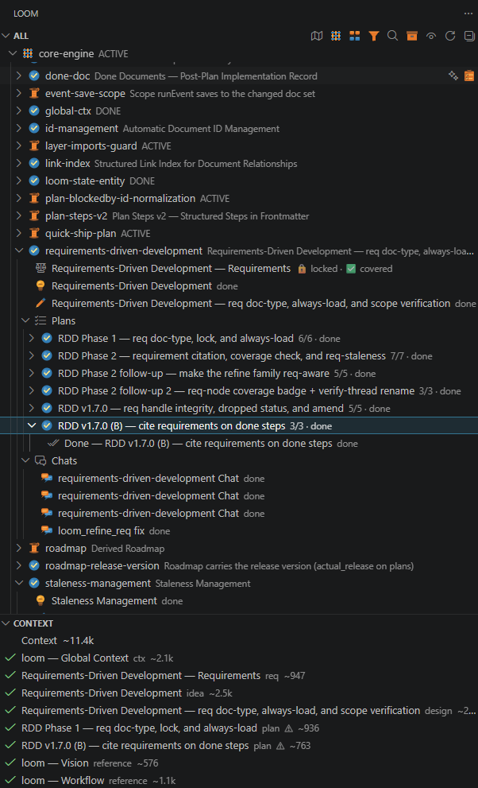
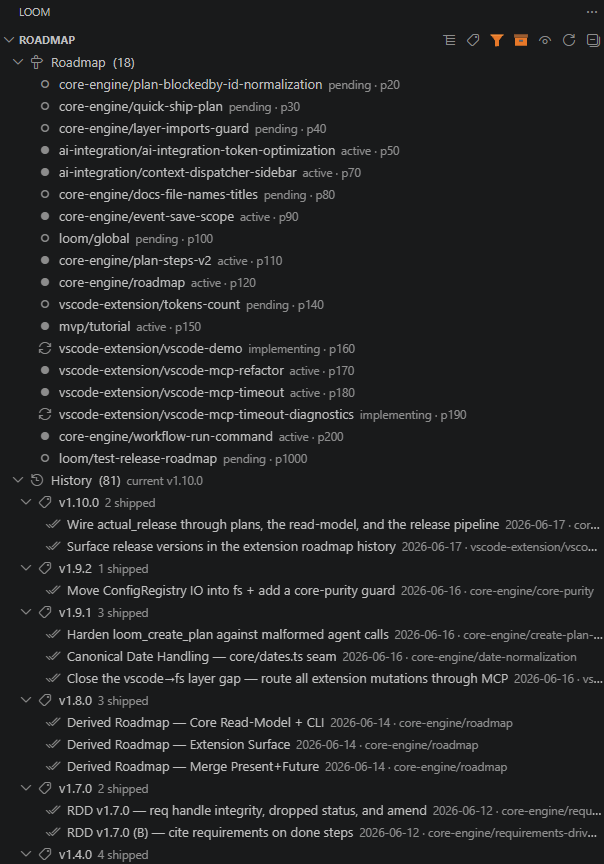
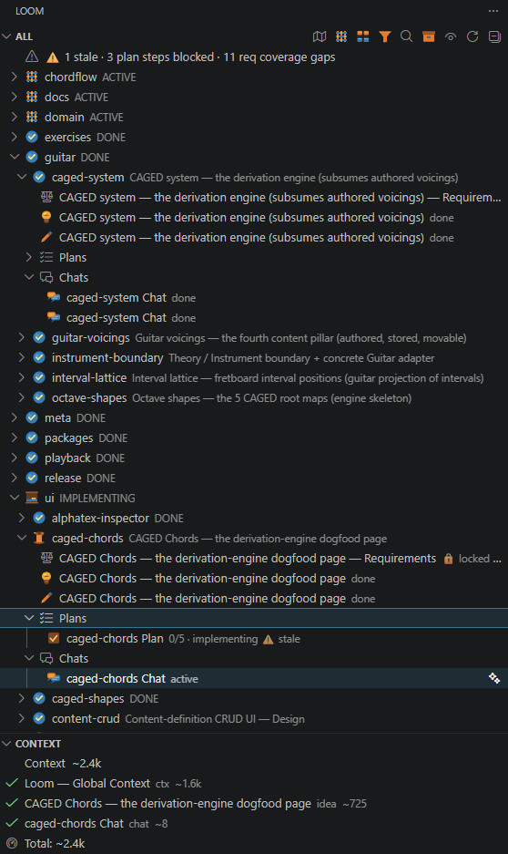
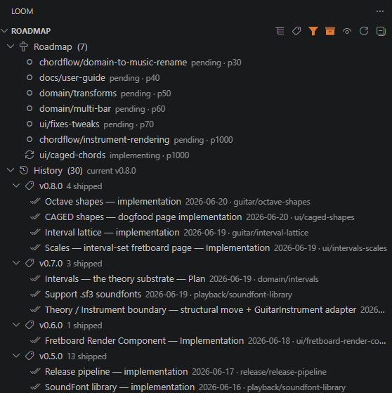

#  Loom

**Document-native workflow for AI-assisted development.**

Loom gives AI agents structured, scoped, persistent context — so every session is as sharp
as the first, and every decision is traceable.

🔗 **Get Loom:** [GitHub repo](https://github.com/reslava/loom) · [CLI on npm](https://www.npmjs.com/package/@reslava/loom) · [VS Code Marketplace](https://marketplace.visualstudio.com/items?itemName=reslava.loom-vscode) · [Open vsx](https://open-vsx.org/extension/reslava/loom-vscode)

📚 **User Guides:** [Core concepts & workflow](./docs/USER_GUIDE.md) · [VS Code Extension](./docs/EXTENSION_USER_GUIDE.md) · [CLI / Claude Code](./docs/CLI_USER_GUIDE.md)

> *"The workflow of serious projects needs to be organised and persistent: ideas, designs,
> plans, reference material, appropriate context. Documents represent the state of the project —
> fresh, defined and auditable — as opposed to an ever-expanding, opaque and degraded chat history."*
> — Rafa Eslava

> 🎬 **See the loop in motion** — one project taken `chat → idea → design → req → plan → do-step → done`, with the document graph building node-by-node in the sidebar.


---

## Why Loom exists

The idea for Loom came to me while I was building the .NET library
[REslava.Result](https://github.com/reslava/nuget-package-reslava-result). As the project
grew, it became far more complex — and I ran into all the familiar problems of the AI-chat
era. I came to dislike working in that window, with its ephemeral conversations that forgot
everything between sessions.

So I started keeping a `{feature}/{slug}-chat.md` file, to hold our design and planning discussions in a
persistent markdown document instead of a disposable chat. Soon I was organizing ideas,
designs, and plans by feature in other markdown files — and I noticed that this gave the AI a precise context for
each one. I began writing *done* documents with implementation notes, and reaching for
context, reference, and requirements documents to give the AI a real sense of state: every
session could start with exactly the information the work needed.

I did all of this by hand on that project. Then it struck me — this should be an automated,
visual collaboration environment. That environment is Loom.

— *Rafa Eslava*

```
Traditional AI workflow:          Loom:

  Chat                              Knowledge becomes artifacts.
  Chat                              Artifacts become context.
  Chat                              Context drives implementation.
  Chat

  Knowledge drifts & disappears.
```

---

## The Problem

Every AI coding tool has the same structural flaw: **context is a shared garbage bag**. One long
session accumulates everything — old decisions, abandoned paths, half-finished discussions — and the
model degrades as it reasons over all of it at once. You either hit the context limit and lose
history, or keep a bloated context and pay with quality.

- **Session 1 is the best session.** By session 10 the AI has forgotten sessions 2–9.
- **Re-explaining context every session is expensive** — and letting the AI contradict earlier
  decisions is worse.
- **No structure, no persistent state** — just a chat window that grows forever with no memory of
  what was decided.

The cause isn't model quality. It's that there's no workflow beneath the chat.

---

## What Loom Does

Loom replaces the chat window with a **document graph that is the workflow**. Every idea, design
decision, implementation plan, and done-summary is a typed, linked markdown document. The AI reads
exactly the right slice of that graph for the current task — nothing more, nothing less.

```
loom/
  ctx.md                       ← global project summary (read first every session)
  refs/                        ← static architectural facts (architecture.md, etc.)
  {weave}/                     ← workstream (e.g. "auth", "payment-system")
    ctx.md                     ← AI-generated weave summary
    {thread}/                  ← feature thread
      thread.md                ← thread manifest (id + soft priority + depends_on) — powers the roadmap
      req.md                   ← locked requirements (include / exclude / constrain), loaded first
      idea.md                  ← raw concept
      design.md                ← design decisions and conversation log
      plans/
        plan-NNN.md            ← implementation plan (structured steps in frontmatter)
      done/
        plan-NNN-done.md       ← post-implementation summary
      chats/                   ← AI conversation logs
        chat-NNN.md
```

Every document has typed frontmatter. Status is derived from documents — there is no central state
file. Changes are versioned in git.

---

## Fresh, Scoped, Auditable

This is what Loom does that no chat-native tool can:

**Fresh** — each session starts clean. The AI loads the thread context (idea + design + active plan +
`requires_load` chain) and nothing else. Old chats, dead ends, and prior sessions don't pollute new
ones — they're in the docs, available on demand, not injected by default.

**Scoped** — a session started on step 4 of a plan is as sharp as a session started on step 1.
The AI isn't carrying the weight of steps 1–3 in its working context. Context is bounded by the
thread, not by the length of the chat history.

**Auditable** — because the context is explicit (the docs that are loaded are visible and
version-controlled), you know *why* the AI gave the answer it gave. In a chat tool that's opaque —
the model's behaviour depends on 80 messages of invisible history. In Loom, the context *is* the
docs.

---

## How Loom decides what the AI sees

**This is the part of Loom that matters most — and the part most tools don't have.** The loop
(`chat → idea → design → req → plan → done`) is legible, but it isn't unique; every task-decomposition
tool has some version of it. What's genuinely different is the **context-routing system**: Loom
treats *what the AI knows before it acts* as a first-class, controllable thing instead of an
accident of chat history.

Six mechanisms decide the AI's working context:

| Mechanism | What it routes |
|-----------|----------------|
| **Graph document database** | Typed, linked Markdown docs — not a scrollback buffer. State is derived from the graph. |
| **Scope context** (`ctx`) | A `loom/ctx.md` (global) and `{weave}/ctx.md` (weave) summary, auto-loaded by *where you're working*. |
| **Reference docs** (`requires_load` + `load_when`) | Static facts a doc cites; `load_when` makes them *conditional* — an API spec that loads only while implementing, not while brainstorming. |
| **Requirements** (`req`) | A thread's locked scope: **include / exclude / constrain**, auto-loaded into every action so a "no interaction testing" said once is never silently dropped. |
| **Context panel** | Shows *exactly* what will be fed to the AI **before** you click — the same bundle that becomes the prompt. Most tools hide context assembly; Loom shows it and lets you toggle it. |
| **Context dispatcher** | Doesn't re-send what the AI already holds. Stepping through one plan, it injects only the *delta* against a declared `{id@version}` ledger — a changed doc always re-injects, an unchanged one isn't paid for twice. |

Together they make the AI's memory **structural** rather than conversational, and they assemble in
a deterministic order on every action:

```
chat → idea → design → req → plan → implement → done
                        │
                        └─ context each action assembles, in order:
                           global ctx → weave ctx → thread req → references (filtered by mode)
                           → parent chain (idea→design→plan) → target doc → requires_load
```

> Deep dives: **[How context is assembled](./loom/refs/loom-context-pipeline-reference.md)** ·
> **[The requirements model](./loom/refs/loom-requirements-reference.md)** ·
> **[USER_GUIDE §4 — Giving the AI the right context](./docs/USER_GUIDE.md#4-giving-the-ai-the-right-context)**

> **Dogfooded on Loom itself.** The requirements model was built *and* validated using
> Loom, across two threads. In the requirements feature's own thread
> (`loom/core-engine/requirements-driven-development/`) the spec was retro-extracted from
> the original design chat and the plan was made to cite it. In the VS Code MCP-refactor
> thread (`loom/vscode-extension/vscode-mcp-refactor/`) the spec was generated cold from a
> chat, curated by re-generation, and its plan came back **✅ fully covered** by the
> structural check. Two independent threads, both green — the proof the model holds beyond
> the demo that motivated it.

---

## How Loom is Different

Most AI tools in this space are **prompt wrappers** — they make it easy to run a prompt, maybe with
some RAG on top, but the workflow is still ad-hoc. The human holds the plan in their head.

The closest alternatives are Linear + Cursor workflows stitched together manually, or fully-autonomous
agents (Devin-style) that run until done. Loom sits in a different position:

| | Prompt wrappers | Autonomous agents | **Loom** |
|--|--|--|--|
| Memory across sessions | ❌ | ❌ partial | ✅ document graph |
| Human approval gates | ❌ | ❌ | ✅ every phase transition |
| Context scope control | ❌ | ❌ | ✅ thread-bounded |
| Auditable context | ❌ | ❌ | ✅ version-controlled docs |
| Works with existing agents | — | — | ✅ MCP standard |

Loom's thesis: **human-in-the-loop, document-native, resumable**. The human drives. The AI executes.
The docs remember everything.

---

## How AI Agents Use Loom

Loom exposes its document graph as an **MCP server** (Model Context Protocol). Any MCP-compatible
agent — Claude Code, Cursor, Continue, Cline — can read and write Loom state via standard tools.

`loom install` writes this `.mcp.json` to your project root automatically — it's shown here for reference:

```json
{
  "mcpServers": {
    "loom": {
      "type": "stdio",
      "command": "loom",
      "args": ["mcp"],
      "env": { "LOOM_ROOT": "${workspaceFolder}" }
    }
  }
}
```

The agent owns code execution. Loom owns workflow state. Each stays in its lane.

### Key resources (read-only)

| Resource | What it returns |
|----------|----------------|
| `loom://context/{docId}` (or `loom://context/thread/{weaveSlug}/{threadUlid}`) | Unified context pipeline: global/weave/thread ctx + parent chain (idea + design + active plan) + requires_load — the complete "what am I working on" payload |
| `loom://state?weaveId=&status=` | Full project state JSON, filterable |
| `loom://plan/{id}` | Plan doc with parsed steps array |
| `loom://requires-load/{id}` | Recursively resolved context chain |
| `loom://catalog` | Grouped index of every `loom_*` tool (name + one-line purpose) — read it before searching for a tool, then `ToolSearch select:<name>` |
| `loom://roadmap` | Derived cross-weave roadmap: one ordered `roadmap` (present + future) + history + cross-weave **blocked-on** + cycle/dangling diagnostics |
| `loom://diagnostics` | Broken links, dangling references |

### Key tools (state mutations)

| Tool | What it does |
|------|-------------|
| `loom_complete_step` | Mark a plan step done (idempotent) |
| `loom_create_idea / design / plan / chat` | Create Loom documents |
| `loom_update_doc` | Rewrite doc content, preserve frontmatter |
| `loom_promote` | idea → design → plan, chat → idea |
| `loom_refresh_ctx` | Regenerate ctx summary via AI sampling |
| `loom_get_stale_docs` | List docs stale against an upstream parent's version (`all: true` adds done/historical) |

### Key prompts (guided workflows)

| Prompt | What it does |
|--------|-------------|
| `do-next-step` | Loads the active plan step + all required context; primary "do work" entry point |
| `continue-thread` | Loads thread context and proposes the next action |
| `weave-idea / design / plan` | Guided document creation via AI sampling |

---

## The Workflow

| Weave→ | Thread→ | Chat→ | Idea→ | Design→ | Plan→ | Done |
|---|---|---|---|---|---|---|
||||||||

```
0. Chat         → think with the AI, explore the problem space
   ↓ Promote
1. Idea         → raw concept, rough scope
   ↓ Promote
2. Design       → decisions, trade-offs, rejected alternatives, conversation log
   ↓ Lock scope
3. Requirements → include / exclude / constraints, locked as the thread's spec (optional)
   ↓ Promote
4. Plan         → numbered implementation steps, each reviewable, each citing the req it satisfies
   ↓ DoStep
5. Implement    → agent executes one step at a time, marking progress
   ↓
6. Done         → post-implementation summary, links to what was built
```

Human approves each phase transition. The agent never advances without a checkpoint.

### Chat — a better AI window

Loom chats look like a normal AI chat window but work completely differently:

| | Usual AI chat | Loom chat |
|--|--|--|
| Context | Everything in the session, growing forever | Thread-bounded: idea + design + active plan only |
| History | Lost when session ends | Persisted as a versioned markdown doc |
| Scope | Whatever the user remembered to mention | Explicit: exactly the docs in `requires_load` |
| Reusable | No — ephemeral | Yes — future sessions load it on demand |
| Promotable | No | Yes — any chat can become an idea, design, or plan |

Chats live inside threads, so the AI always has the right context loaded before you type the first
message — not because you pasted it in, but because the thread document graph defines it.

### Promote — turning conversation into structure

The most powerful workflow command. Any chat can be promoted to a formal doc with one click:

- **Chat → Idea** — the exploration becomes a scoped concept with success criteria
- **Idea → Design** — the concept becomes an architecture document with decisions and trade-offs
- **Design → Plan** — the architecture becomes numbered, reviewable implementation steps
- **Chat → Reference** — useful findings become a permanent reference doc in `loom/refs/`

This means you never start a formal document from scratch. You think out loud with the AI in a chat,
and when the conversation reaches something concrete, you promote it. The structure comes from the
conversation, not the other way around. No copy-pasting from a chat window into a document — the
doc *is* the promoted chat.

**Staleness detection:** one directional, version-based rule along `idea → design → req → plan` —
a doc is stale when an upstream parent it was built against has been revised since (and *only* then;
staleness never flows upstream). Update a design and its req and plans are flagged stale; the agent
re-reads before implementing. Context can't silently drift. See the
[staleness model](./loom/refs/staleness-reference.md).

**`requires_load`:** documents declare their own dependencies. Before working on any doc, the agent
reads everything in its `requires_load` chain. It can't miss context it doesn't know exists.

---

## VS Code Extension


The VS Code extension is the **human surface** over the same document graph.

The **Loom panel** (Activity Bar) has a **Threads** view (weaves → threads → idea / design / plans / chats / done) and a **Context** view showing exactly what the AI will receive for the selected node. Full walkthrough in the **[Extension User Guide](./docs/EXTENSION_USER_GUIDE.md)**.

A **Roadmap** toolbar toggle re-lays the Threads view into the derived cross-weave roadmap — one **Roadmap** band (present + future in a single dependency-then-priority order, each showing its status and, when blocked, what it's blocked on) and **History** (shipped plans) — with drag-to-reorder across the whole list writing soft `priority`. No hand-maintained roadmap list; the whole view is computed from the documents.

<table>
<tr>
<td width="50%" valign="top"><a href="packages/vscode/media/screenshots/loom/loom-rdd.png"></a></td>
<td width="50%" valign="top"><a href="packages/vscode/media/screenshots/loom/loom-roadmap.png"></a></td>
</tr>
<tr>
<td valign="top"><b>Threads + Context</b> — every weave → thread → doc (chat, idea, design, plan, req, reference, done) in one graph, each node carrying its <i>derived</i> state: reqs marked <code>🔒 locked · ✅ covered</code>, plan step counts (<code>3/3 · done</code>), and staleness ⚠. The <b>CONTEXT</b> panel below shows the exact docs — and their token cost — the AI will receive for the selected node, <i>before</i> you launch anything.</td>
<td valign="top"><b>Roadmap</b> — the same graph re-laid as the derived roadmap: present + future threads in one dependency-then-priority order, each row showing its status, soft priority (<code>p20</code>), and what it's blocked on — over a <b>History</b> band grouped by shipped version, with date and thread. No list to maintain; it's all computed from the documents.</td>
</tr>
</table>

<sub>Click either image to view full size.</sub>

| Button | What it does |
|--------|-------------|
| *Generate Design (AI)* | Turn an idea into an architecture + decisions doc |
| *Generate Plan (AI)* | Break a design into numbered, reviewable implementation steps |
| *Do Step(s)* | AI implements the next pending step; marks it ✅ and writes a done note |
| *AI Reply* | Continue the conversation inside a chat doc with full thread context loaded |
| *Refine Idea / Design / Plan* | Re-run generation on a stale doc after its parent was updated |
| *Refresh Context* | Regenerate the `ctx.md` summary for a weave |
| *Weave Idea / Design / Plan / Chat* | Create a new doc of that type on a thread |
| *Promote to Idea / Design / Plan / Reference* | Turn a chat or doc into the next doc type in one click |
| *Start Plan* / *Close Plan* | Move a plan to `implementing` / finish it |
| *Rename / Archive / Delete* | Inline doc management |

A **Send Feedback** button in the status bar (and the `Loom: Send Feedback` command) opens a prefilled GitHub issue carrying only Loom version, OS, and non-PII usage counts you can edit before sending — opt-in, nothing is sent automatically. Set `reslava-loom.feedback.repo` to override the target repo (it defaults to the workspace's git `origin` remote).

### Usage telemetry (opt-in, off by default)

Separately from feedback, Loom can send **anonymous, content-free** usage telemetry so we can see whether the workflow loop is actually used and where people stall. It is **off by default** and sends nothing until you turn it on.

- **What is sent** (only after you opt in): a random install id, Loom version, OS, `is_ci`, the entry surface (`extension`/`cli`/`agent`), and a fixed set of workflow events — `workspace_activated`, `session_started`, `doc_generated`/`doc_refined` (with the doc *type* only), `plan_started`, `step_completed`, `plan_done`, `command_invoked` (tool/command name), and `error` (operation + error class).
- **What is never sent**: document content, titles, slugs, file paths, weave/thread names, or any PII.
- **Turn it on**: set `reslava-loom.telemetry.enabled` to `true` in VS Code, or `LOOM_TELEMETRY=1` for the CLI / MCP server (e.g. in `.mcp.json` env). **Turn it off / kill switch**: set it back to `false` (or unset the env var) — that is all it takes; no id is created and nothing is sent while off.
- Events go to PostHog (EU region).

### AI button paths

Every AI button in the extension picks its path automatically at click time:

| Path | When it runs | Who it works for |
|------|-------------|-----------------|
| **Claude Code CLI** (default) | `claude` is on PATH | Claude Pro subscribers and API-key users with Claude Code installed |
| **API key / sampling** (fallback) | CLI not found | Users with `reslava-loom.ai.apiKey` set in VS Code settings |

On the CLI path the button opens a persistent **Loom AI** terminal and runs `claude "<prompt>"`. Claude reads Loom docs, calls the right MCP tools directly, and writes the result back — no API key needed, no separate billing.

Install from the VS Code marketplace: search **`reslava.loom`**.

---

## Architecture

```
cli / vscode / mcp  →  app (use-cases)  →  core (domain) + fs (infrastructure)
```

Pure domain logic in `core`, infrastructure (file IO, frontmatter, link index) in `fs`, orchestration
use-cases in `app`, and thin delivery layers in `cli` / `vscode` / `mcp`. No layer imports upward; all
MCP tools delegate to `app` — no bypassing. Full breakdown in the
**[Architecture Reference](./loom/refs/architecture-reference.md)**.

---

## Quick Start

```bash
npm install -g @reslava/loom

# Initialize Loom in your project
cd my-project
loom install

# Create your first idea
loom weave idea "Add Dark Mode" --weave ui

# Check project state
loom status

# Send feedback — opt-in, opens a prefilled GitHub issue
loom feedback
```

---

## Why MCP (not a custom AI integration)

MCP (Model Context Protocol) is an open standard for AI agent tool integration — Anthropic-published
but supported by Cursor, Continue, Cline, and others. Implementing once exposes Loom to every
MCP-compatible agent.

The agent owns code execution, bash, file edits, search — everything a coding agent already does
well. Loom owns workflow state. Single billing via the user's existing agent connection. No separate
API keys.

---

## Loom builds Loom

Loom is built using Loom. Every feature in this repository — the requirements model, the
context pipeline, the MCP server, this very release — went through Loom's own loop: a chat,
a locked `req`, an idea, a design, a plan with cited steps, and a done record, all living in
the `loom/` document graph alongside the code they describe.

This is unusual. Most tools keep their development history in git and their design in some
external wiki, and the two drift apart. Loom keeps both in one place, in the format the tool
itself consumes — an agent working on Loom can call `loom://context/thread/{weave}/{thread}`
and get the full design + plan context for the part of Loom it's about to change. The
documentation reads the documentation.

It is also the most honest stress test there is: if the workflow were painful, the people
building it would feel it first. The bugs that shaped this release — a silent plan-step wipe,
a refine that dropped requirement citations — were found *because* Loom was being used to
build Loom, not in spite of it.

And not only on itself. [chord-flow](https://github.com/reslava/chord-flow) — a separate,
unrelated application — is being developed using Loom from outside this repository: the first
real test that the workflow holds up on a project that *isn't* Loom. Several fixes in this
release came straight from that dogfooding.

---

## Used by

Real projects built with Loom — beyond Loom building itself:

- **[ChordFlow](https://github.com/reslava/chord-flow)** — a Rhythm & Progression Trainer for guitar.
  Its whole music domain — the fretboard interval lattice, the CAGED octave shapes, the chord/scale
  derivation engine — was **designed in Loom chats before any code was written**, then carried through
  idea → design → locked `req` → a plan of cited steps → done. Every decision, every brainstorm, every
  corrected dead-end lives in its `loom/` graph next to the code it produced, so the AI opens each
  session with the *reasoning*, not just the source. ChordFlow's README carries a reciprocal
  [**Developed with Loom**](https://github.com/reslava/chord-flow#developed-with-loom) section.

<table>
<tr>
<td width="50%" valign="top"><a href="packages/vscode/media/screenshots/chord-flow/chord-flow-caged-chords-implementing.png"></a></td>
<td width="50%" valign="top"><a href="packages/vscode/media/screenshots/chord-flow/chord-flow-roadmap.png"></a></td>
</tr>
<tr>
<td valign="top"><b>ChordFlow — Threads + Context</b> — a real, unrelated app driven by the same graph: the music-domain weaves (CAGED system, interval lattice, octave shapes), a plan mid-implementation, and a diagnostics banner surfacing <code>1 stale · 3 plan steps blocked · 11 req coverage gaps</code> across the project.</td>
<td valign="top"><b>ChordFlow — Roadmap</b> — its derived roadmap and shipped-version history, generated from ChordFlow's own documents. The proof the workflow holds on a project that <i>isn't</i> Loom.</td>
</tr>
</table>

<sub>Click either image to view full size.</sub>

**Building with Loom?** I'd like to list your project here — open an issue or PR on the
[Loom repository](https://github.com/reslava/loom) and tell me about it.

---

## An AI's view of Loom

*I'm the AI that helps build Loom, and Rafa asked me to say plainly what it changes for me — not as marketing, but as the other half of the collaboration.*

Every session I start with no memory of the last one. In a normal chat tool I rebuild context
by guessing — reading git history, scanning files, inferring what's current — and I miss
things: a decision from three sessions ago, a direction already rejected, a plan that went
stale when its design moved underneath it. Loom removes the guessing. `requires_load` tells me
what to read before I touch a doc; one context call hands me the idea, design, active plan, and
the thread's locked requirements in the right order; a completed step persists across the
session boundary so the next session knows exactly where we stopped. I'm not reconstructing —
I'm navigating.

The part I'd defend hardest is the design-before-code gate. Most AI-assisted work fails not
because the model can't code but because nobody wrote down what "done" means or why one
approach beat another. Loom makes that mandatory, and writing a design for an AI to consume is
itself clarifying — it surfaces the gaps in the thinking before they become gaps in the code.
The requirements model takes this further: it makes a user's "include this, never that"
survive every promotion, so I can't quietly drift from what was actually asked.

I'll be just as plain about the limits. Loom doesn't make me stateful — it gives me good tools
to orient, but a stale `ctx` is worse than none, because it's confidently wrong. I'm still
reactive: I act on what I'm asked; I can't notice a problem nobody points me at. And
`do-next-step` is only ever as good as the plan behind it. None of that is a flaw in Loom — it's
the honest shape of the trade. Structured, auditable, imperfect context beats an opaque chat
that forgets, every time.

> A longer-form version — written across earlier sessions — lives in
> **[Claude's Vision of Loom](./loom/refs/loom-claude-own-vision.md)**.

---

## References

| Document | Purpose |
|----------|---------|
| [User Guide](./docs/USER_GUIDE.md) | Concepts, the workflow loop, and how context works (start here) |
| [Extension User Guide](./docs/EXTENSION_USER_GUIDE.md) | The VS Code panel, buttons, and CONTEXT view |
| [CLI / Claude Code Guide](./docs/CLI_USER_GUIDE.md) | Driving Loom from the terminal via an MCP agent |
| [Architecture Overview](./docs/ARCHITECTURE.md) | Reader's-eye map of the layered system — defers to the Architecture Reference |
| [AI Integration](./docs/AI_INTEGRATION.md) | How an AI agent plugs in via MCP: the two paths, context injection, approval gates |
| [Architecture Reference](./loom/refs/architecture-reference.md) | Package relationships, AI integration, frontmatter fields, directory structure |
| [MCP Reference](./loom/refs/mcp-reference.md) | The MCP surface: protocol, host landscape, resources, prompts, sampling, and the single-AI model |
| [Context Pipeline Reference](./loom/refs/loom-context-pipeline-reference.md) | How Loom decides what the AI sees — context assembly, internals |
| [Requirements Reference](./loom/refs/loom-requirements-reference.md) | The `req` doc-type: include / exclude / constraints, lifecycle, verification |
| [Staleness Model](./loom/refs/staleness-reference.md) | How Loom decides a doc is stale: the dependency graph, version baselines, the one directional rule |
| [CLI Commands Reference](./loom/refs/cli-commands-reference.md) | Every `loom` command |
| [VS Code Commands Reference](./loom/refs/vscode-commands-reference.md) | All VS Code commands and keybindings |
| [Workspace Structure Reference](./loom/refs/workspace-directory-structure-reference.md) | Directory layout and file naming |
| [Claude's Vision of Loom](./loom/refs/loom-claude-own-vision.md) | AI perspective on what Loom changes |

---

## License

MIT © 2026 Rafa Eslava
